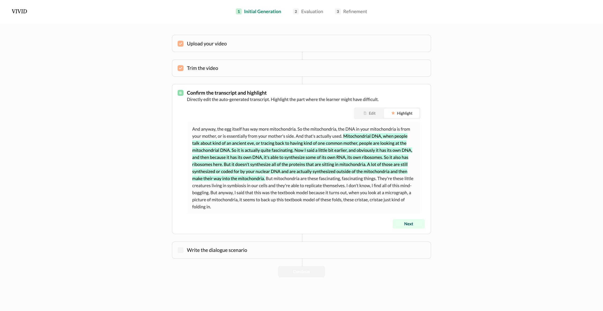
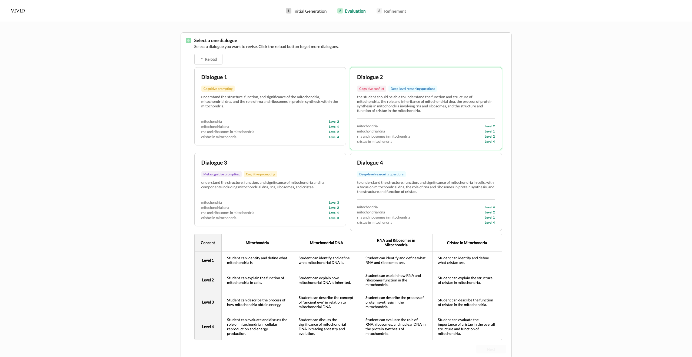
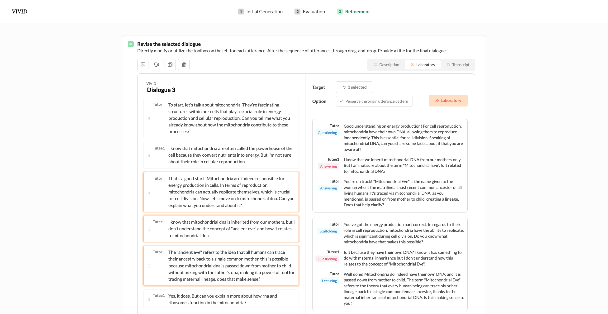

# VIVID

This is the frontend code of system VIVID from
  **VIVID: Human-AI Collaborative Authoring of Vicarious Dialogues
from Lecture Videos** Seulgi Choi, Hyewon Lee, Yoonjoo Lee, and Juho Kim. 2023
(ACM CHI 2024 published)

**VIVID** is an LLM(Large Language Model) collaborative authoring tool to design, evaluate, and modify pedagogical dialogues. It only requires a monologue styled lecture video to create a high-quality educational dialogue script.

### COMMING SOON

- [ ] Demo with pre-selected video

##  

### Recorded Demo

> System demo from 00:55

### Abstract

The lengthy monologue-style online lectures cause learners to lose engagement easily. Designing lectures in a “vicarious dialogue” format can foster learners’ cognitive activities more than monologue- style. However, designing online lectures in a dialogue style catered to the diverse needs of learners is laborious for instructors. We conducted a design workshop with eight educational experts and seven instructors to present key guidelines and the potential use of large language models (LLM) to transform a monologue lecture script into pedagogically meaningful dialogue.

Applying these design guidelines, we created VIVID which allows instructors to collaborate with LLMs to design, evaluate, and modify pedagogical dialogues. In a within-subjects study with instructors (N=12), we show that VIVID helped instructors select and revise dialogues effi- ciently, thereby supporting the authoring of quality dialogues. Our findings demonstrate the potential of LLMs to assist instructors with creating high-quality educational dialogues across various learning stages.

---

### Implementation

This project is consist of 3 main steps with several beneath substeps. **1) Initial Generation 2) Evalutaion 3) Refinement**. To manage these steps and states this project adapted **Redux** based on **React**.

It connects with **Flask** based backend server and Whisper API which are indicated in environment variables. To utilize your own server, copy `.env.copy` as `.env` and fill the entries.
Currently server is not provided.

To enhance the usability of the system, it was designed with various micro-interactions.

